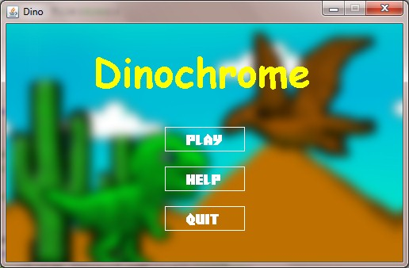
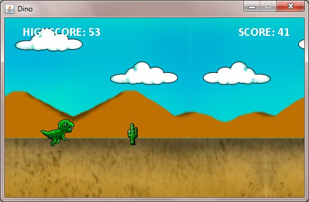
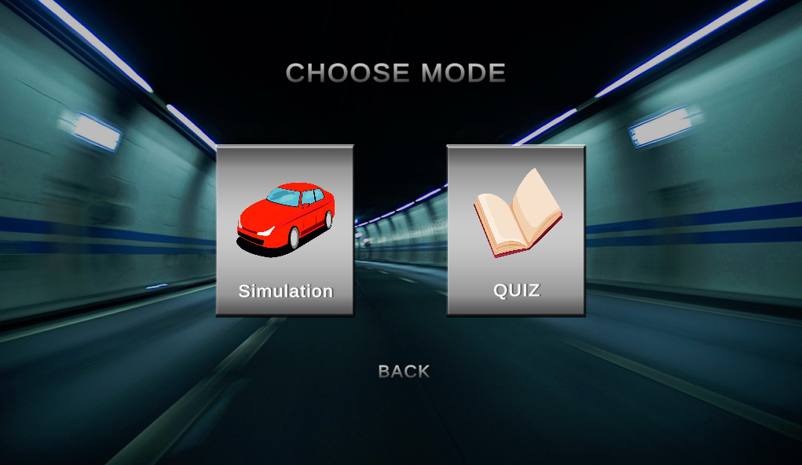
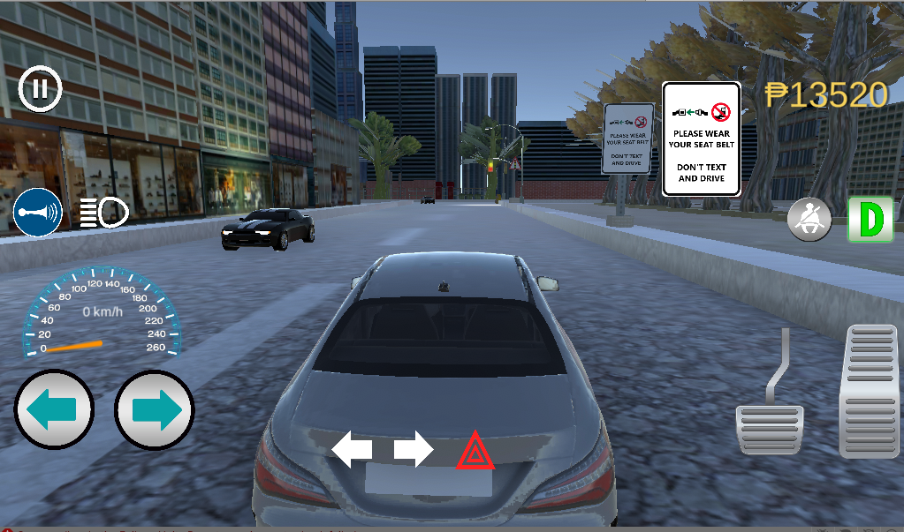
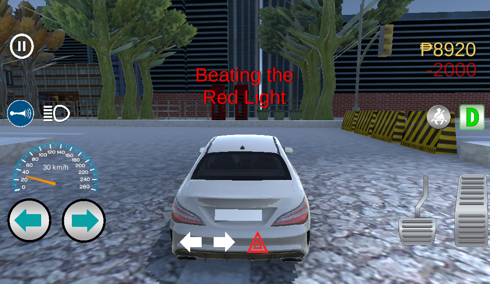
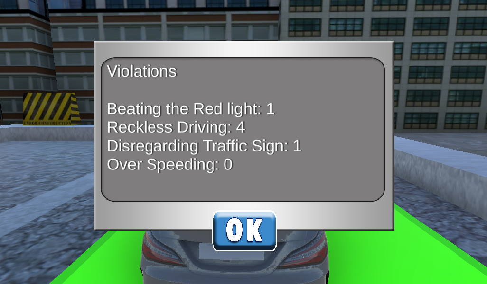
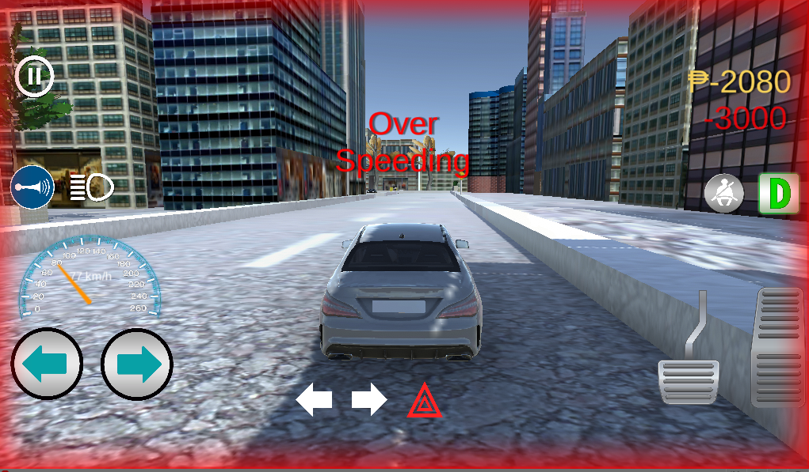
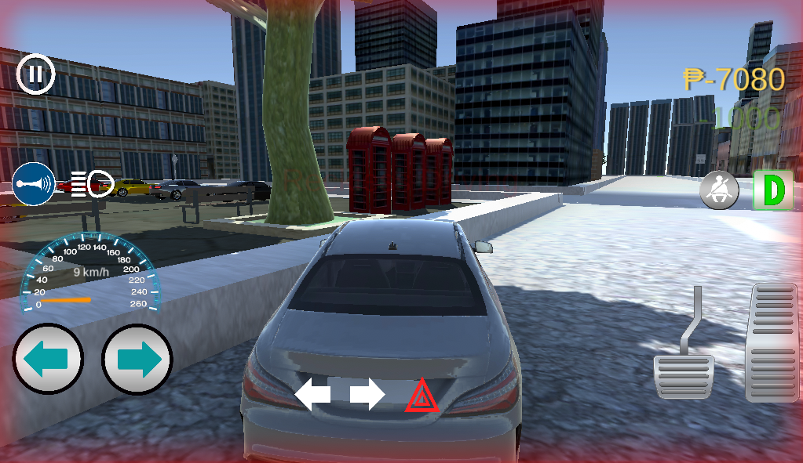
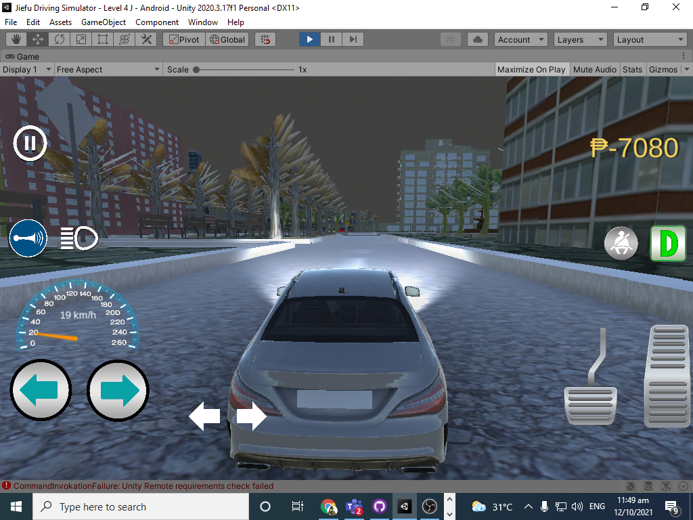

 

    

  <h3 align="center">Welcome to my Profile! Let me introduce you to my world</h3>

### About my self

I’m a kind of person who loves making games and has a lot of imagination that I need to express in order for me to be happy, I’ve been studying Information Technology and I am currently on my last years in college, My goal is to become a game developer where I can express my Ideas and see happiness in people’s eyes who plays my video games. 

My first interest was not really game programming but rather to become an artist, I love drawing characters when I was a kid and I just love how I see the things that are inside my mind when I draw them. Later I discovered animation, that’s when I had an opportunity during my senior high school years that I took the Animation strand which is my interest. Besides being artistic I also love writing stories which makes animation as my perfect fit. But then I discovered that computer programming was also one of the subjects there. And it amazed me so much that I all I thought everyday was about programming, and here I am again trying to find a canvas where I can put another art.

### My skills

- :video_game: Unity Engine to make 3d or 2d games
- :computer: JAVA, C#, C++, HTML, CSS and PHP
- :framed_picture: Adobe Photoshop
- :moyai: Blender
- :iphone: Android Studio

### My recent Projects

<a href="https://github.com/RJAmoto/DinosaurGame"><strong>DinoChrome</strong></a>
 
  This is something familiar, because it is the same game that you play whenever there is no internet... But I upgraded it and put colors on it and extra challenges. This is the first game that I made.

   
   
      
<a href="https://github.com/RJAmoto/Jiefu-Driving-Simulator"><strong>Jiefu Driving Simulator</strong></a>
 
  

  
 
  <h3 align="center">Jiefu Driving Simulator</h3>

  

    A Driving simulator with real life Philippine road challenges, Traffics and rules
     
   <a href="https://github.com/RJAmoto"><strong>Follow me on Github</strong></a>
   .
   <a href="https://https://www.upwork.com/freelancers/~01f821e50fba8d65f2"><strong>Upwork</strong></a>
   .
   <a href="https://www.linkedin.com/in/rudolph-john-agpoon-602370223/"><strong>Linked in</strong></a>
  

 This is a driving simulation game that can educate the user and by using the rules and regulation based on the Philippine traffic rules and regulation. Users will be educated by a quiz mode on the game which is also a reviewer if ever that they want to get a license. They may also test their skills using the actual driving simulation that incorporates real life scenarios in Philippine roads.

#### Watch our trailer on Youtube
   
https://youtu.be/ZzQ0zjj0o3o

  
  

 
## About the project
 
 ### Features 
 * Traffic light Control System
 * Violation Triggers
 * 10 Levels
 * Quiz mode
 * Simulation Mode
 * Menu Screen and Settings
 * Sound effects
 * Pause and Resume
 * Monetary System and Rewards
 
 ### Car Modules
 * Head Lights
 * Brake Lights
 * Signal Lights
 * Horn
 * Reverse and Drive
 * Brake
 * Speedometer
 * Seatbelt
 * Left and Right Button Steering
 
 
## Screenshots

 
 
 
 
 
 
 

 
## Team

* **Rudolph John Agpoon - Lead Developer**
* **Nomer Fabroliña - Environment Design**
* **Jeff Rivera - Environment Design 3D model**
* **Richmond Ramil - Documentation** 

## Installation Guide
   
I have 2 ongoing games that I'll be posting later
### Links
<a href = "https://www.facebook.com/rudolphjohn.agpoon/">Facebook</a>
 
<a href = "https://www.linkedin.com/in/rudolph-john-agpoon-602370223/"> LinkedIn </a>
 
<a href = "https://www.upwork.com/freelancers/~01f821e50fba8d65f2"> Upwork </a>

