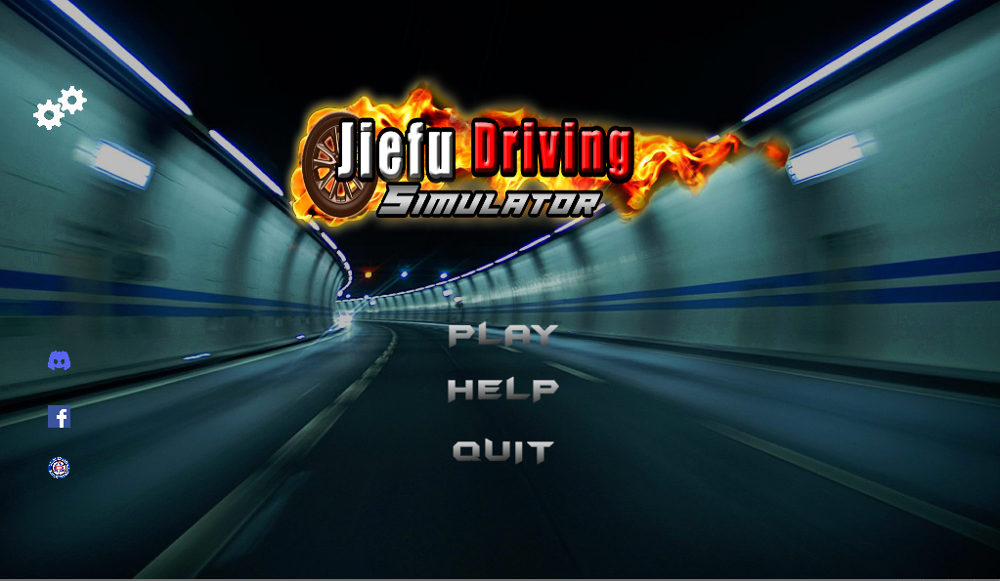
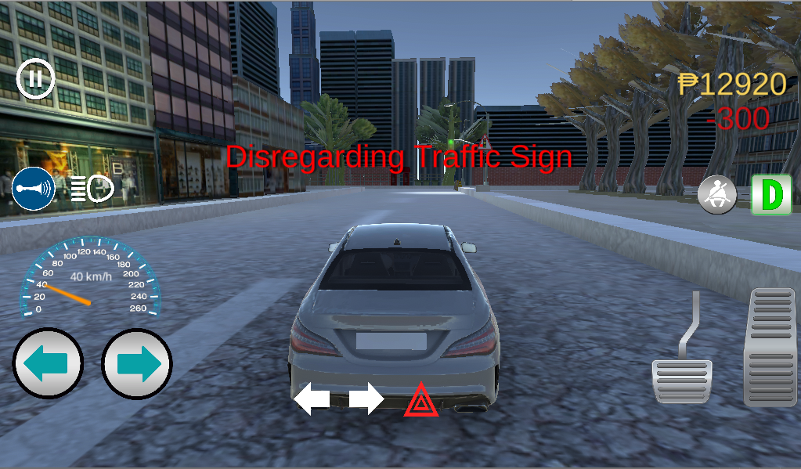

 

    

  <h3 align="center">Welcome to my Profile! Let me introduce you to my world</h3>

### About my self

I’m a kind of person who loves making games and has a lot of imagination that I need to express in order for me to be happy, I’ve been studying Information Technology and I am currently on my last years in college, My goal is to become a game developer where I can express my Ideas and see happiness in people’s eyes who plays my video games. 

My first interest was not really game programming but rather to become an artist, I love drawing characters when I was a kid and I just love how I see the things that are inside my mind when I draw them. Later I discovered animation, that’s when I had an opportunity during my senior high school years that I took the Animation strand which is my interest. Besides being artistic I also love writing stories which makes animation as my perfect fit. But then I discovered that computer programming was also one of the subjects there. And it amazed me so much that I all I thought everyday was about programming, and here I am again trying to find a canvas where I can put another art.

When I first took college, the language that they thought us was Java. Which later became my foundation in studying game programming and even C#, I watched a lot of tutorials and read books about programming. Until such time that I thought maybe I could use my Artistic skills in programming, and that’s when I discovered game development which I found perfect for me to express my ideas.

### My skills

- :video_game: Unity Engine to make 3d or 2d games
- :computer: JAVA, C#, C++, HTML, CSS and PHP
- :framed_picture: Adobe Photoshop
- :moyai: Blender
- :iphone: Android Studio

### My recent Projects

<a href="https://github.com/RJAmoto/DinosaurGame"><strong>DinoChrome</strong></a>
 
  This is something familiar, because it is the same game that you play whenever there is no internet... But I upgraded it and put colors on it and extra challenges. This is the first game that I made.

   
   
      
<a href="https://github.com/RJAmoto/Jiefu-Driving-Simulator"><strong>Jiefu Driving Simulator</strong></a>
 
  This project is still going on and This is my first game using unity, The goal of this project is to educate People about driving challenges and real life situations on the road which they might not be ready.
    
   
   

